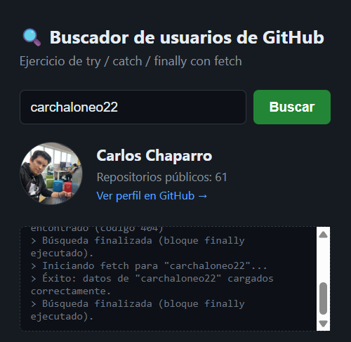

# 🔍 Buscador de Usuarios de GitHub

Ejercicio práctico de JavaScript enfocado en el manejo de errores con `try / catch / finally` en un proyecto web real, consumiendo la API pública de GitHub.


## 📋 Descripción

Esta pequeña aplicación permite buscar un usuario de GitHub por su nombre de usuario y mostrar su avatar, nombre y cantidad de repositorios públicos. El objetivo principal del ejercicio es **aprender a manejar errores de forma robusta** en un entorno web, cubriendo casos como:

- El usuario no existe en GitHub.
- Fallo de conexión a internet.
- Campo de búsqueda vacío.




## 🎯 Objetivos de aprendizaje

- Usar `try / catch / finally` junto con `async / await`.
- Lanzar errores manualmente con `throw new Error(...)`.
- Diferenciar entre errores de red y errores de lógica de negocio.
- Mostrar retroalimentación visual al usuario sin romper la aplicación.
- Manejar estados de carga (`loading`) de forma segura con `finally`.

## 🗂️ Estructura del proyecto

```
├── buscador-github.html   # Archivo único con HTML, CSS y JS
└── README.md              # Este archivo
```

## 🚀 Cómo usarlo

1. Clona o descarga este repositorio.
2. Abre el archivo `buscador-github.html` directamente en tu navegador (no requiere servidor ni instalación de dependencias).
3. Escribe un nombre de usuario de GitHub válido (ej. `octocat`) y presiona **Buscar** o `Enter`.
4. Prueba también con un nombre inexistente para ver el manejo de errores en acción.

## 🧠 Código clave

```javascript
async function buscarUsuario(username) {
  const respuesta = await fetch(`https://api.github.com/users/${username}`);

  if (!respuesta.ok) {
    throw new Error(`Usuario "${username}" no encontrado (código ${respuesta.status})`);
  }

  return respuesta.json();
}

try {
  const datos = await buscarUsuario(username);
  // mostrar datos en pantalla
} catch (error) {
  // mostrar mensaje de error amigable
} finally {
  // ocultar spinner de carga, se ejecute lo que se ejecute
}
```

## 🛠️ Tecnologías utilizadas

- HTML5
- CSS3
- JavaScript (Fetch API, `async/await`, `try/catch/finally`)
- [GitHub REST API](https://docs.github.com/en/rest/users/users) (endpoint público, sin autenticación)

## 📚 Reto adicional

¿Quieres seguir practicando? Intenta:

- Crear una clase de error personalizada (`class ApiError extends Error`).
- Agregar un límite de reintentos si falla la conexión.
- Guardar en `localStorage` las últimas búsquedas exitosas.

## 📄 Licencia

Este proyecto es de uso libre con fines educativos.
